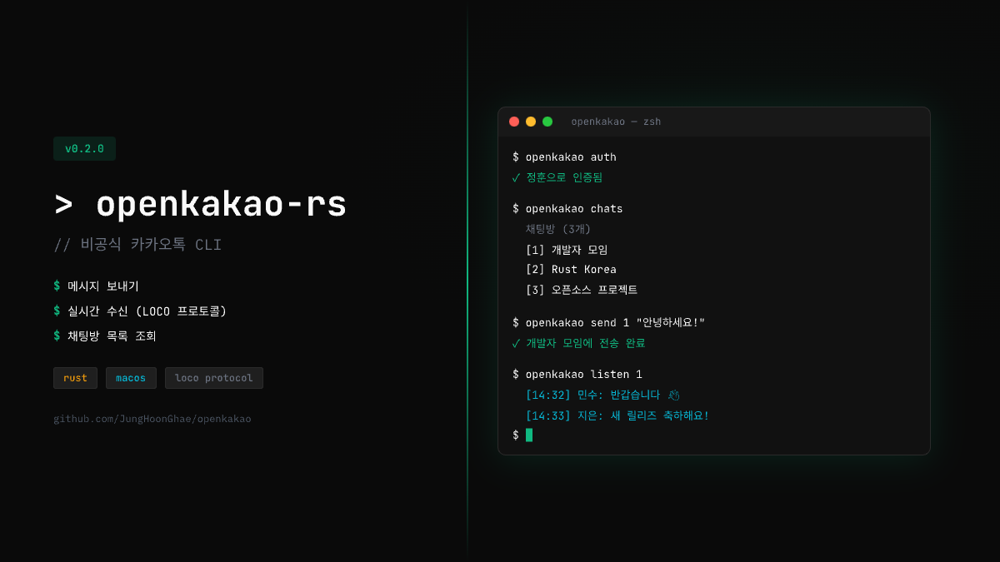

# openkakao-cli

Unofficial KakaoTalk CLI client for macOS. Full LOCO protocol and REST API access — send messages, read history, watch real-time, and automate your KakaoTalk from the terminal.

<p align="center">
  
</p>

<p align="center">
  <a href="#installation">Installation</a> ·
  <a href="#setup">Setup</a> ·
  <a href="#commands">Commands</a> ·
  <a href="#loco-protocol">LOCO Protocol</a>
</p>

## Features

- **Full LOCO Protocol**: Booking → Checkin → Login flow with RSA-2048/AES-128-GCM encryption
- **X-VC Authentication**: Cracked the Mac X-VC header algorithm via static binary analysis
- **Send & Receive**: Send messages, watch real-time incoming messages, react, delete, mark as read
- **Full Chat History**: Read complete message history via LOCO SYNCMSG (no REST cache limits)
- **Local Cache**: Persistent SQLite message cache — `watch` saves incoming messages, `read` merges local + remote
- **Auto-Reconnect**: `watch` with configurable exponential backoff and NDJSON event stream
- **Automation-Ready**: `--json` output on major commands, `--completion-promise` for LLM agent integration

## Installation

### Homebrew (recommended)

```bash
brew install JungHoonGhae/openkakao/openkakao-cli
```

### Build from source

```bash
git clone https://github.com/JungHoonGhae/openkakao-cli
cd openkakao/openkakao-cli
cargo build --release
# Binary at: ./target/release/openkakao-cli
```

## Setup

```bash
# 1. Extract credentials from running KakaoTalk app
openkakao-cli login --save

# 2. Verify token
openkakao-cli auth

# 3. Health check
openkakao-cli doctor
```

> KakaoTalk must be running and logged in for initial credential extraction.

## Commands

### Messaging (LOCO)

| Command | Description |
|---------|-------------|
| `send <chat_id> <message>` | Send a message (`-y` skip confirm, `--force` for open chats) |
| `delete <chat_id> <log_id>` | Delete a message (`-y` skip confirm) |
| `mark-read <chat_id> <log_id>` | Mark messages as read up to log_id |
| `react <chat_id> <log_id>` | Add a like reaction (type=1; only supported type on macOS) |
| `edit <chat_id> <log_id> <msg>` | Edit a message (macOS returns -203; Android only) |
| `send-file <chat_id> <file>` | Send a photo/video/file attachment |

### Reading

| Command | Description |
|---------|-------------|
| `read <chat_id>` | Read chat history (LOCO-first, merges local cache) |
| `chats` | List all chat rooms (LOCO-first) |
| `members <chat_id>` | List chat room members |
| `chatinfo <chat_id>` | Show chat room details (`0` = find/create MemoChat) |
| `download <chat_id> <log_id>` | Download media attachment from a message |

### Real-time

| Command | Description |
|---------|-------------|
| `watch` | Real-time message stream (auto-reconnects with backoff) |
| `watch --chat-id <id>` | Filter to a specific chat room |
| `watch --read-receipt` | Auto-send read receipts on incoming messages |
| `watch --download-media` | Auto-download media attachments |
| `watch --capture` | Capture raw packets to `capture.jsonl` (protocol analysis) |
| `watch --json` | NDJSON event stream (includes reconnect events) |

**Auto-reconnect options:**

| Flag | Default | Description |
|------|---------|-------------|
| `--max-reconnect N` | 10 | Max reconnect attempts (0 = unlimited) |
| `--reconnect-delay <sec>` | 2 | Initial backoff delay (doubles each attempt) |
| `--reconnect-max-delay <sec>` | 60 | Maximum backoff cap |

### Auth & Credentials

| Command | Description |
|---------|-------------|
| `auth` | Check token validity |
| `auth-status` | Show persisted auth recovery state |
| `login --save` | Extract credentials from KakaoTalk's Cache.db |
| `relogin` | Refresh token via login.json |
| `renew` | Attempt token renewal via refresh_token |
| `me` | Show your profile |
| `friends` | List friends |
| `settings` | Show account settings |

### Diagnostics

| Command | Description |
|---------|-------------|
| `doctor` | Full health check (credentials, LOCO connection, version drift) |
| `stats <chat_id>` | Chat analytics (message counts, hourly histogram, top senders) |
| `cache` | Show local message cache stats |
| `cache-search <query>` | Full-text search across cached messages |
| `cache-stats` | Database statistics |

### Global Flags

| Flag | Description |
|------|-------------|
| `--json` | Output as JSON (supported by most commands) |
| `--completion-promise` | Print `[DONE]` on success (LLM agent integration) |
| `--force` | Allow operations on open chats (higher ban risk) |

## Configuration

Config file: `~/.config/openkakao/config.toml`

```toml
[auth]
# Run this command to get password for unattended relogin
password_cmd = "doppler secrets get KAKAO_PASSWORD -p openkakao -c dev --plain"
# Or store directly (less secure)
# email = "you@example.com"

[watch]
reconnect_delay_secs = 2
reconnect_max_delay_secs = 60
max_reconnect = 10
```

See `config.example.toml` for all options.

## LOCO Protocol

KakaoTalk's proprietary binary messaging protocol:

```
booking-loco.kakao.com:443 (TLS)
  └─ GETCONF → checkin hosts, ports
       └─ ticket-loco.kakao.com (RSA+AES handshake)
            └─ CHECKIN → LOCO server IP:port
                 └─ LOCO server (RSA+AES handshake)
                      └─ LOGINLIST → status=0, chatDatas[]
                           └─ ready for commands
```

### Encryption

- Handshake: RSA-2048 (e=3, OAEP/SHA-1) to exchange AES key
- Data: AES-128-GCM with per-frame 12-byte nonce (encrypt_type=3)
- Packet: 22-byte LE header + BSON body

### X-VC Header

Required for fresh `login.json` access tokens:

```
SHA-512("YLLAS|{loginId}|{deviceUUID}|GRAEB|{userAgent}")[0:16]
```

### Known Platform Restrictions (macOS dtype=2)

| Command | Error | Notes |
|---------|-------|-------|
| REWRITE (edit) | -203 | Android dtype=1 only |
| GETMSGS | -300 | Use SYNCMSG instead |
| ACTION type≠1 | -203 | Only like (type=1) supported |

## Architecture

```
src/
├── main.rs               # CLI entry point, clap dispatch
├── lib.rs                # Library re-exports (for integration tests)
├── commands/             # Command modules
│   ├── analytics.rs      # stats, cache, cache-search, cache-stats
│   ├── auth.rs           # auth, auth-status, login, renew, relogin
│   ├── chats.rs          # chats, chatinfo
│   ├── doctor.rs         # doctor diagnostic
│   ├── download.rs       # media download
│   ├── members.rs        # members, blocked
│   ├── probe.rs          # probe, chatinfo (LOCO)
│   ├── profile/          # profile, profile-hints, friend graph
│   ├── read.rs           # read (LOCO + local cache merge)
│   ├── rest.rs           # me, friends, settings, export, search
│   ├── send.rs           # send, send-file, edit, delete, mark-read, react
│   └── watch.rs          # watch + reconnect + NDJSON
├── loco/
│   ├── client.rs         # LOCO protocol client
│   ├── crypto.rs         # RSA + AES-128-GCM
│   └── packet.rs         # 22-byte header + BSON codec
├── message_db.rs         # Local SQLite message cache
├── auth_flow.rs          # Token refresh/relogin recovery chain
└── rest.rs               # REST API (katalk.kakao.com)
```

## Development

```bash
cd openkakao-cli
cargo build
cargo test
cargo clippy -- -D warnings
OPENKAKAO_RS_DEBUG=1 cargo run -- doctor  # Debug logging
```

## License

MIT
