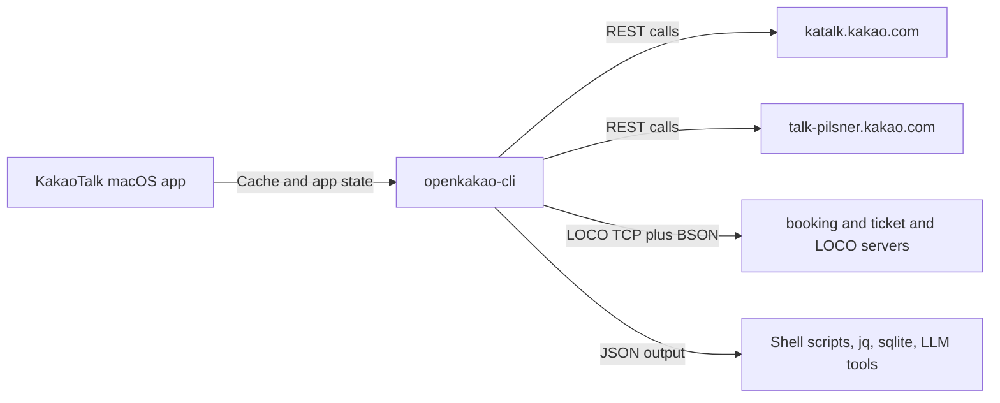

import { Bot, History, Send, ShieldCheck } from 'lucide-react';

<Callout title="Works without logging in">
[`local-send`/`ax-read`](/docs/cli/local-send) drive KakaoTalk's UI directly through the macOS Accessibility API, so sending and reading real messages both work with no server session at all — just KakaoTalk running and already logged in.
</Callout>

<Callout type="warn" title="Server login is broken on recent KakaoTalk builds">
`login --save`/`login --manual` fail on current KakaoTalk macOS builds ([#15](https://github.com/JungHoonGhae/openkakao-cli/issues/15), [#20](https://github.com/JungHoonGhae/openkakao-cli/issues/20), [#22](https://github.com/JungHoonGhae/openkakao-cli/issues/22)) — not needed for the path above. **Do not repeatedly retry login from an unregistered device — it can get your account's sub-device login blocked.**
</Callout>

## Introduction

OpenKakao is a beta-stage unofficial KakaoTalk CLI for macOS for developers, terminal-native users, and automation-heavy workflows. It opens a usable local surface around chats, history, watch events, and controlled outbound actions.

OpenKakao is most useful when you need a narrow local bridge between KakaoTalk and tools you already control.

<Cards>
  <Card icon={<History />} title="Read and structure chat context" href="/docs/cli/message">
    Inspect message history, unread state, and chat metadata before you automate anything else.
  </Card>
  <Card icon={<Bot />} title="Trigger local workflows" href="/docs/automation/overview">
    Use watch mode, hooks, and webhooks to connect KakaoTalk events to scripts, queues, and operator tools.
  </Card>
  <Card icon={<Send />} title="Send carefully" href="/docs/cli/send">
    Keep outbound actions explicit, reviewable, and easy to narrow when automation starts touching real chats.
  </Card>
  <Card icon={<Bot />} title="Send and read without logging in" href="/docs/cli/local-send">
    `local-send`/`ax-read` drive the real KakaoTalk UI directly — no server session, no local DB dependency.
  </Card>
  <Card icon={<ShieldCheck />} title="Know the trust boundary" href="/docs/security/trust-model">
    Understand what is read locally, what is stored, and where privacy and account-safety assumptions change.
  </Card>
</Cards>

<Callout title="Want to evaluate fit first?">
  Start with [Automation Overview](/docs/automation/overview) if you are deciding whether OpenKakao fits your workflow. Move to [Trust Model](/docs/security/trust-model) once you need the risk boundary.
</Callout>

## Start Here

<Cards>
  <Card title="Use Cases" href="/docs/automation/overview">
    Where OpenKakao becomes useful in real workflows.
  </Card>
  <Card title="Getting Started" href="/docs/getting-started/quickstart">
    Install, authenticate, and read a chat in a few minutes.
  </Card>
  <Card title="Security" href="/docs/security/trust-model">
    What the CLI touches, stores, and where the risks are.
  </Card>
  <Card title="CLI Reference" href="/docs/cli/overview">
    Command-by-command reference for real usage.
  </Card>
  <Card title="REST vs LOCO" href="/docs/getting-started/transport-boundary">
    Decide which transport fits which task.
  </Card>
  <Card title="Protocol Notes" href="/docs/protocol/overview">
    Deeper technical notes on LOCO and transport behavior.
  </Card>
</Cards>

## Where It Helps

OpenKakao is strongest when you need one of these outcomes:

- turn unread chats into summaries, dashboards, or review queues
- export message history into JSON, SQLite, or local search tools
- trigger local scripts or webhooks from watch events
- use KakaoTalk as an input channel for operator tools, LLMs, or agents
- move careful outbound actions into a controlled local workflow

## Working Model

Use the transport boundary as a rule of thumb:

- REST for fast account checks and cache-backed reads
- LOCO for real chat workflows, watch mode, media, and sending

<Callout title="Keep the model small">
  OpenKakao is not a hosted messaging platform. It is a local bridge for inspecting, structuring, and narrowing automation around a real KakaoTalk session.
</Callout>

## Next Paths

- New here: [Why OpenKakao](/docs/overview/why-openkakao)
- Ready to try it: [Installation](/docs/getting-started/installation)
- Need the trust boundary first: [Data & Credentials](/docs/security/data-and-credentials)
- Want practical patterns: [Common Recipes](/docs/automation/common-recipes)
